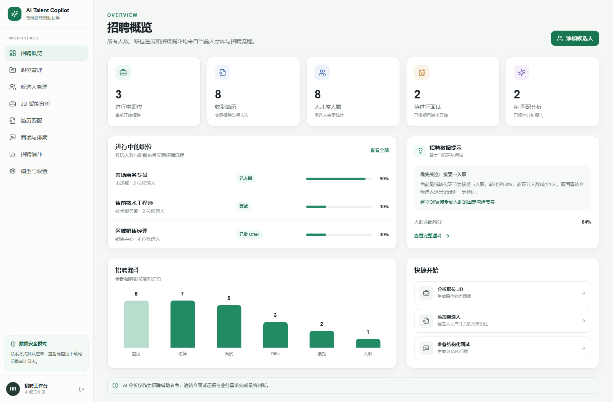
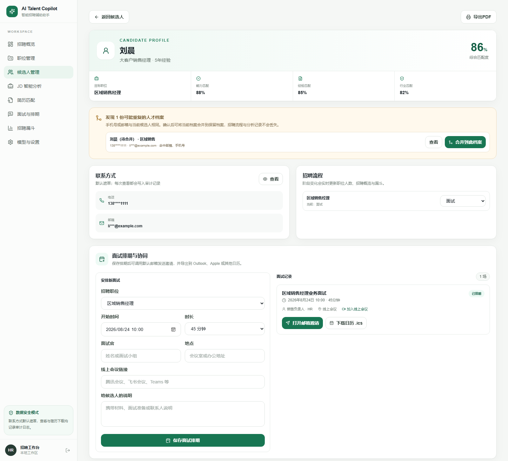
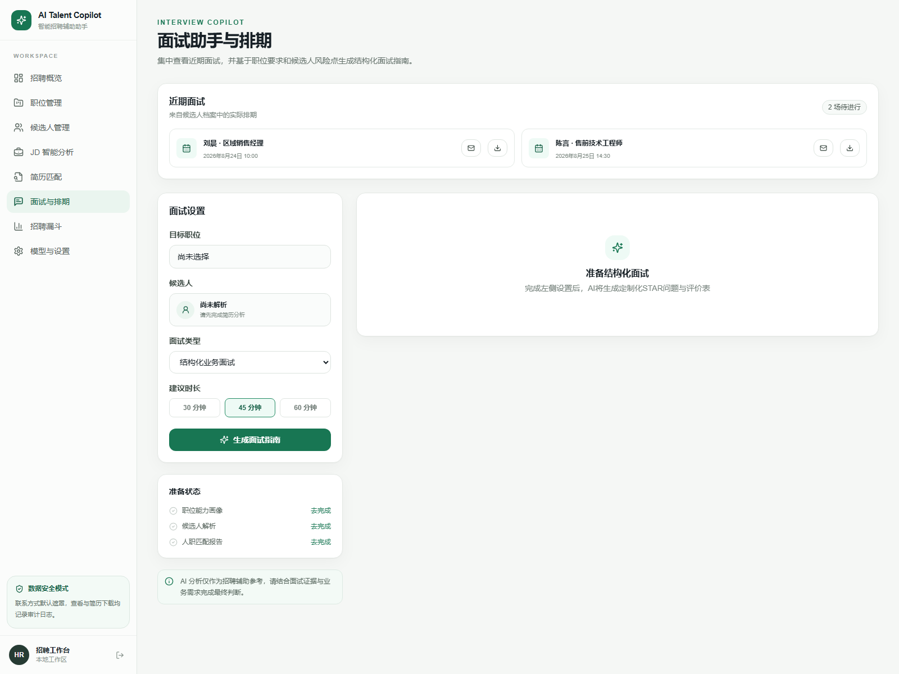

# AI Talent Copilot（智能招聘辅助助手）

AI Talent Copilot 是一个面向企业 HR 和招聘顾问的 AI 招聘辅助决策工具。它将职位理解、简历筛选、面试准备和招聘漏斗复盘连接成一条可解释的工作流。

> AI 负责整理信息、发现线索和生成建议；HR 保留校正权和最终决策权。

## 为什么做这个项目

这个项目不是单纯的技术 Demo，而是从真实 HR 工作场景出发的产品实践。

开发者拥有 2 年以上企业 HR 经验，曾支持销售、市场商务、技术服务三个业务部门，累计招聘 13 人，并使用 Excel 搭建过招聘漏斗表和 HC 管理表。在实际工作中，职位需求容易依赖个人经验、简历筛选耗时、面试质量不一致、招聘数据分散等问题长期存在。AI Talent Copilot 尝试把这些隐性经验转化为可复用、可校正、可追溯的产品能力。

## 核心能力

- **JD 智能分析**：提取职位类型、能力画像、必须条件、加分条件与面试关注点。
- **简历解析**：支持 PDF、DOCX、TXT，并在进入分析前隐藏手机号、邮箱和身份证号。
- **人职匹配**：输出能力、经验、行业和必须条件评分，同时展示简历原文证据。
- **AI 面试助手**：围绕职位能力和候选人风险生成 STAR 问题、追问、正向/风险信号。
- **招聘漏斗**：自动计算各环节转化率，定位流失环节并生成验证建议。
- **职位与人才库管理**：候选人可独立进入人才库，也可加入一个或多个职位流程；概览与漏斗自动按实际阶段汇总。
- **候选人查重与合并**：手机号或邮箱任一命中时阻止重复建档，可将新分析或已有重复档案安全合并到统一人才档案。
- **面试排期协同**：候选人详情中保存面试时间、面试官、地点和会议链接，自动生成邮件邀请并导出标准 `.ics` 日历文件。
- **联系方式与原始简历**：详情页默认遮罩电话和邮箱，按需查看并记录审计日志；已保存的原始简历可受控下载。
- **PDF 报告**：匹配报告和面试指南提供打印友好版式，可通过浏览器另存为 PDF。
- **访问保护**：配置访问码后启用全站登录保护，认证 Cookie 为 HttpOnly。

## 功能截图

### 招聘概览



概览中的职位、候选人、AI 匹配和待面试数量均由实际业务数据动态计算，招聘漏斗也会随候选人阶段变化实时更新。

### 候选人查重、隐私保护与面试排期



系统通过手机号或邮箱识别重复人才档案，支持合并记录；联系方式默认遮罩并记录查看审计，同时可直接维护招聘阶段、安排面试、生成邮件邀请和下载日历文件。

### 面试协同工作台



面试助手集中展示近期排期、候选人和对应职位，并提供邮件与日历入口，帮助小型团队完成轻量协同。以上截图均使用虚构演示数据。

## 产品原则

1. **辅助而非替代**：不自动淘汰候选人，不替 HR 作录用决定。
2. **证据优先**：匹配结论尽可能关联简历原文，不只展示一个分数。
3. **区分缺失与不具备**：简历未提及的内容标为“待验证”，不直接判定为能力缺失。
4. **公平与合规**：不使用年龄、性别、婚育、民族、照片等敏感属性评分。
5. **默认安全**：公开仓库不包含数据库、候选人数据或密钥；敏感信息默认遮罩，查看与下载可审计。

## 项目文档

- [产品案例与设计决策](./docs/CASE_STUDY.md)
- [3–5分钟面试演示讲稿](./docs/INTERVIEW_DEMO_SCRIPT.md)
- [部署与GitHub发布指南](./docs/DEPLOYMENT.md)
- [安全策略](./SECURITY.md)

## 产品架构

```text
职位 JD → 职位能力画像 → 简历解析 → 人职匹配 → 面试指南
                                          ↓
                               招聘漏斗与过程复盘
```

页面：

| 路由 | 功能 |
| --- | --- |
| `/` | 今日招聘概览与快捷入口 |
| `/jd-analysis` | JD 输入、职位画像、关键词和信息缺口 |
| `/resume-analysis` | 文件上传、身份显示策略、结构化解析与人职匹配报告 |
| `/interview` | 近期面试排期、邮件/日历协同、STAR 问题、追问路径和评价模板 |
| `/dashboard` | 招聘漏斗、转化率与 AI 诊断 |
| `/jobs` | 已保存职位与招聘状态管理 |
| `/candidates` | 候选人列表、匹配报告与HR复核 |
| `/candidates/new` | 添加候选人、上传原始简历并关联招聘职位 |
| `/settings` | 模型配置状态和连接测试 |

## 技术架构

- Next.js 15、React 19、TypeScript
- Tailwind CSS、Lucide Icons
- Next.js Route Handlers
- Prisma ORM、SQLite
- Zod 结构化输出校验
- `pdf-parse`、`mammoth` 文件文本提取
- Provider 模式封装大模型调用

AI 层统一实现 `LLMProvider` 接口。默认使用确定性的 `MockProvider`，无需密钥即可完整演示；目前内置 OpenAI Responses、OpenAI-compatible（已验证 DeepSeek，也可接 GLM 等兼容服务）和 Anthropic Messages Provider。

```text
JDAnalysisService ─┐
ResumeService ─────┼─→ LLMProvider → Mock / OpenAI Responses / GLM兼容 / Claude
MatchService ──────┤
InterviewService ──┘
```

## 快速开始

环境要求：Node.js 20+、pnpm 9+。

### Windows一键启动

直接双击项目根目录的 `一键启动 AI Talent Copilot.cmd`。启动器会自动：

1. 检查Node.js与pnpm；
2. 首次运行时安装依赖、复制 `.env.example` 并初始化空白数据库；
3. 启动开发服务并等待健康检查通过；
4. 自动打开 `http://localhost:3000`。

服务器会运行在标题包含 `AI Talent Copilot Server` 的窗口中，关闭该窗口即可停止应用。启动器不会覆盖已有 `.env`，因此已经配置的DeepSeek API不会丢失。

### 命令行启动

```bash
pnpm install
copy .env.example .env
pnpm run db:setup
pnpm dev
```

打开 `http://localhost:3000`。初始工作区为空，不会自动写入任何演示职位或候选人。

Windows PowerShell 如果提示禁止运行 `npm.ps1` 或 `pnpm.ps1`，可以显式使用 `.cmd`：

```powershell
pnpm.cmd install
Copy-Item .env.example .env -Force
pnpm.cmd run db:setup
pnpm.cmd dev
```

如需作品集演示，虚构示例文件位于 `demo-data/`，由用户主动载入；它们不会自动进入数据库。

### 切换真实模型

编辑 `.env`：

```dotenv
LLM_PROVIDER="openai-compatible"
LLM_API_KEY="your-api-key"
LLM_BASE_URL="https://api.openai.com/v1"
LLM_MODEL="your-model"
```

### 使用 DeepSeek

DeepSeek 使用 OpenAI-compatible 分支。在项目根目录的 `.env` 中配置：

```dotenv
LLM_PROVIDER="openai-compatible"
LLM_API_KEY="your-deepseek-api-key"
LLM_BASE_URL="https://api.deepseek.com"
LLM_MODEL="deepseek-chat"
```

模型名以 DeepSeek 控制台当前可用值为准。修改后必须停止并重新运行 `pnpm.cmd dev`，然后在“模型与设置”页面点击“测试模型连接”。不要把真实API Key提交到Git或放进截图；如果密钥曾公开显示，应立即在控制台删除并重新生成。

`.env` 只对它所在的项目目录生效。如果重新解压了新版本，需要把原项目的DeepSeek配置迁移到新目录的 `.env`，或在新目录中重新配置；启动后应先到“模型与设置”确认Provider不是 `mock`。Mock模式只进行基于当前输入的基础规则分析，不会调用DeepSeek，也不会再复用内置候选人资料。

密钥仅在服务端读取，不会发送到浏览器。模型返回结果通过 Zod Schema 校验后才进入业务流程。

也可以在 `.env` 中使用：

```dotenv
# OpenAI Responses API
LLM_PROVIDER="openai"

# Claude Messages API
LLM_PROVIDER="anthropic"
```

启动后可在“模型与设置”页面查看服务端配置状态并执行连接测试。页面不会读取或显示API Key。

## 启用登录保护

本地默认不要求登录。部署时设置：

```dotenv
APP_ACCESS_CODE="your-workspace-code"
AUTH_SECRET="a-long-random-secret"
AUTH_COOKIE_SECURE="false"
```

重启服务后，页面和业务API都会要求登录。本地HTTP保持 `AUTH_COOKIE_SECURE="false"`；正式HTTPS部署时改为 `true`，并使用独立、足够长的随机密钥。

## 导出PDF

在匹配报告或面试助手中点击“打印 / 导出PDF”，在浏览器打印窗口中选择“另存为PDF”。打印样式会自动隐藏导航、输入区和操作按钮。

## Docker部署

项目包含 `Dockerfile` 和 `docker-compose.yml`。安装Docker Desktop后运行：

```bash
docker compose up --build -d
```

默认通过 `http://localhost:3000` 访问，SQLite数据保存在命名卷 `talent_data`。正式部署前务必修改Compose中的访问码和认证密钥，并将模型密钥通过安全的环境变量或Secrets服务注入。

健康检查接口：`GET /api/health`。

当前SQLite版本需要长期运行的单实例和持久化磁盘，不适合直接部署到无持久化文件系统的Serverless环境。完整上线检查见[部署指南](./docs/DEPLOYMENT.md)。

## 数据模型

核心表包括：`Job`、`JobAnalysis`、`Candidate`、`Application`、`MatchAnalysis`、`InterviewGuide`、`InterviewSchedule`、`FunnelSnapshot`、`AiAnalysisTask`、`AuditLog`。其中 `Application` 是候选人与招聘职位之间的流程记录，也是概览和漏斗的唯一统计来源；`InterviewSchedule` 保存面试协同数据。详细字段见 `prisma/schema.prisma`。

SQLite 用于本地 MVP 和作品集演示。多用户生产环境建议迁移到 PostgreSQL，并补充企业级鉴权、数据保留策略、对象存储加密和审计能力。

## 演示建议

1. 在 JD 分析页载入示例并重新分析；
2. 在简历页上传虚构 TXT/DOCX/PDF，或从候选人管理直接添加人才库记录；
3. 查看匹配分数与“来自简历原文”的证据；
4. 在候选人详情安排面试，打开邮件邀请并下载 `.ics` 日历文件；进入面试助手生成结构化问题；
5. 在候选人详情修改招聘阶段，观察概览、职位人数和漏斗自动同步。

## 匹配等级口径

匹配分数由模型根据职位画像与简历证据生成，但页面展示文案采用确定性规则，防止出现“低分却建议面试”的矛盾：

| 分数 | 页面结论 | 辅助建议 |
| --- | --- | --- |
| 80–100 | 匹配度高 | 建议进入面试 |
| 60–79 | 匹配度较高 | 建议进一步评估 |
| 40–59 | 匹配度一般 | 建议补充核实 |
| 0–39 | 匹配度较低 | 建议谨慎评估 |

这只是信息组织规则，不会自动修改候选人的招聘状态。HR仍需依据完整证据独立判断。

## 安全说明

- 仅在已获得候选人授权、已配置访问码且设备受控的环境中处理真实招聘数据；
- 上传文件限制为 PDF、DOCX、TXT，最大 5MB；
- 系统仅提取文本，不执行宏、脚本或文件内指令；
- 仅执行解析时，原始文件只在请求中临时读取；HR主动保存候选人后，原始简历会存入本地SQLite以支持后续下载；
- 浏览器只持久化当前编辑中的职位JD，候选人、联系方式、简历和招聘流程以服务端数据库为唯一数据源；
- 简历解析默认保留候选人姓名，便于HR后续管理；HR也可以在解析前主动切换为匿名化；
- 手机号、邮箱和身份证号始终在模型调用前进行基础脱敏，不受姓名显示策略影响；
- 电话与邮箱默认遮罩，主动查看和原始简历下载都会写入审计日志；简历正文不单独持久化；
- AI 输出仅作辅助参考，不能作为自动化录用或淘汰依据。

## 未来优化方向

- 多租户、RBAC 权限与企业 SSO；
- 企业邮箱 API、Google Calendar / Microsoft 365 双向同步；
- 可配置评分权重与职位能力词典；
- 面试官协作、独立评分与偏差检测；
- Prompt / 模型版本对比和质量评估集；
- 招聘渠道质量、周期、成本和 Offer 原因分析；
- PostgreSQL、队列任务、加密对象存储和完整审计日志。

## 免责声明

本项目为招聘辅助工具。所有 AI 结果都可能存在遗漏或误判，最终招聘判断应由具备授权的 HR 和业务负责人基于完整证据共同作出。
